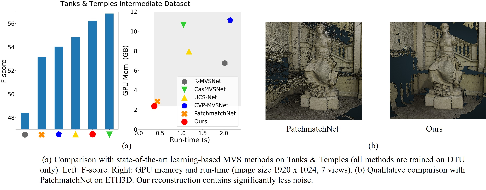

# IterMVS
official source code of paper 'IterMVS: Iterative Probability Estimation for Efficient Multi-View Stereo'

## Introduction
IterMVS is a novel learning-based MVS method combining highest efficiency and competitive reconstruction quality. We propose a novel GRU-based estimator that encodes pixel-wise probability distributions of depth in its hidden state. Ingesting multi-scale matching information, our model refines these distributions over multiple iterations and infers depth and confidence. Extensive experiments on DTU, Tanks & Temples and ETH3D show highest efficiency in both memory and run-time, and a better generalization ability than many state-of-the-art learning-based methods. 



If you find this project useful for your research, please cite: 

```

```

## Installation
### Requirements
* python 3.6
* CUDA 10.1

```
pip install -r requirements.txt
```

## Reproducing Results
* Download pre-processed datasets (provided by PatchmatchNet): [DTU's evaluation set](https://drive.google.com/file/d/1jN8yEQX0a-S22XwUjISM8xSJD39pFLL_/view?usp=sharing), [Tanks & Temples](https://drive.google.com/file/d/1gAfmeoGNEFl9dL4QcAU4kF0BAyTd-r8Z/view?usp=sharing) and [ETH3D benchmark](https://polybox.ethz.ch/index.php/s/pmTGWobErOnhEg0). Each dataset is organized as follows:
```
root_directory
├──scan1 (scene_name1)
├──scan2 (scene_name2) 
      ├── images                 
      │   ├── 00000000.jpg       
      │   ├── 00000001.jpg       
      │   └── ...                
      ├── cams_1                   
      │   ├── 00000000_cam.txt   
      │   ├── 00000001_cam.txt   
      │   └── ...                
      └── pair.txt  
```

Camera file ``cam.txt`` stores the camera parameters, which includes extrinsic, intrinsic, minimum depth and maximum depth:
```
extrinsic
E00 E01 E02 E03
E10 E11 E12 E13
E20 E21 E22 E23
E30 E31 E32 E33

intrinsic
K00 K01 K02
K10 K11 K12
K20 K21 K22

DEPTH_MIN DEPTH_MAX 
```
``pair.txt `` stores the view selection result. For each reference image, 10 best source views are stored in the file:
```
TOTAL_IMAGE_NUM
IMAGE_ID0                       # index of reference image 0 
10 ID0 SCORE0 ID1 SCORE1 ...    # 10 best source images for reference image 0 
IMAGE_ID1                       # index of reference image 1
10 ID0 SCORE0 ID1 SCORE1 ...    # 10 best source images for reference image 1 
...
``` 


### Evaluation on DTU:
* For DTU's evaluation set, first download our processed camera parameters from [here](https://drive.google.com/file/d/10iFOAfGhVV-0evFj4ygy0Cxb6EKJKFqh/view?usp=sharing). Unzip it and replace all the old camera files in the folders ``cams_1`` with new files for all the scans.
* In ``eval_dtu.sh``, set `DTU_TESTING` as the root directory of corresponding dataset, set `--outdir` as the directory to store the reconstructed point clouds.
* `CKPT_FILE` is the path of checkpoint file (default as our pretrained model which is trained on DTU, the path is `checkpoints/dtu/model_000015.ckpt`). 
* Test on GPU by running `bash eval_dtu.sh`. The code includes depth map estimation and depth fusion. The outputs are the point clouds in `ply` format. 
* For quantitative evaluation, download [SampleSet](http://roboimagedata.compute.dtu.dk/?page_id=36) and [Points](http://roboimagedata.compute.dtu.dk/?page_id=36) from DTU's website. Unzip them and place `Points` folder in `SampleSet/MVS Data/`. The structure looks like:
```
SampleSet
├──MVS Data
      └──Points
```
In ``evaluations/dtu/BaseEvalMain_web.m``, set `dataPath` as the path to `SampleSet/MVS Data/`, `plyPath` as directory that stores the reconstructed point clouds and `resultsPath` as directory to store the evaluation results. Then run ``evaluations/dtu/BaseEvalMain_web.m`` in matlab.


The results look like:

| Acc. (mm) | Comp. (mm) | Overall (mm) |
|-----------|------------|--------------|
| 0.373     | 0.354      | 0.363        |


### Evaluation on Tansk & Temples:
* In ``eval_tanks.sh``, set `TANK_TESTING` as the root directory of the dataset and `--outdir` as the directory to store the reconstructed point clouds. 
* `CKPT_FILE` is the path of checkpoint file (default as our pretrained model which is trained on DTU, the path is `checkpoints/dtu/model_000015.ckpt`). We also provide our pretrained model trained on BlendedMVS (`checkpoints/blendedmvs/model_000015.ckpt`)
* Test on GPU by running `bash eval_tanks.sh`. The code includes depth map estimation and depth fusion. The outputs are the point clouds in `ply` format. 
* For our detailed quantitative results on Tanks & Temples, please check the leaderboards ([Tanks & Temples: trained on DTU](https://www.tanksandtemples.org/details/2566/), [Tanks & Temples: trained on BlendedMVS](https://www.tanksandtemples.org/details/2679/)).

### Evaluation on ETH3D:
* In ``eval_eth.sh``, set `ETH3D_TESTING` as the root directory of the dataset and `--outdir` as the directory to store the reconstructed point clouds. 
* `CKPT_FILE` is the path of checkpoint file (default as our pretrained model which is trained on DTU, the path is `checkpoints/dtu/model_000015.ckpt`). We also provide our pretrained model trained on BlendedMVS (`checkpoints/blendedmvs/model_000015.ckpt`)
* Test on GPU by running `bash eval_eth.sh`. The code includes depth map estimation and depth fusion. The outputs are the point clouds in `ply` format. 
* For our detailed quantitative results on ETH3D, please check the leaderboards ([ETH3D: trained on DTU](https://www.eth3d.net/result_details?id=368), [ETH3D: trained on BlendedMVS](https://www.eth3d.net/result_details?id=379)).

### Evaluation on custom dataset:
* We support preparing the custom dataset from COLMAP's results. The script ``colmap_input.py`` (modified based on the script from [MVSNet](https://github.com/YoYo000/MVSNet)) converts COLMAP's sparse reconstruction results into the same format as the datasets that we provide. 
* Test on GPU by running `bash eval_custom.sh`.

## Training
### DTU
* Download pre-processed [DTU's training set](https://polybox.ethz.ch/index.php/s/ugDdJQIuZTk4S35) (provided by PatchmatchNet). The dataset is already organized as follows:
```
root_directory
├──Cameras_1
├──Rectified
└──Depths_raw
```
* Download our processed camera parameters from [here](https://drive.google.com/file/d/1DAAFXV6bZx0NNWFQMwoSeWMt5mr64myD/view?usp=sharing). Unzip all the camera folders into `root_directory/Cameras_1`.
* In ``train_dtu.sh``, set `MVS_TRAINING` as the root directory of dataset; set `--logdir` as the directory to store the checkpoints. 
* Train the model by running `bash train_dtu.sh`.

### BlendedMVS
* Download the [dataset](https://1drv.ms/u/s!Ag8Dbz2Aqc81gVDgxb8MDGgoV74S?e=hJKlvV).
* In ``train_blend.sh``, set `MVS_TRAINING` as the root directory of dataset; set `--logdir` as the directory to store the checkpoints. 
* Train the model by running `bash train_blend.sh`.

## Acknowledgements
Thanks to Yao Yao for opening source of his excellent work [MVSNet](https://github.com/YoYo000/MVSNet). Thanks to Xiaoyang Guo for opening source of his PyTorch implementation of MVSNet [MVSNet-pytorch](https://github.com/xy-guo/MVSNet_pytorch).